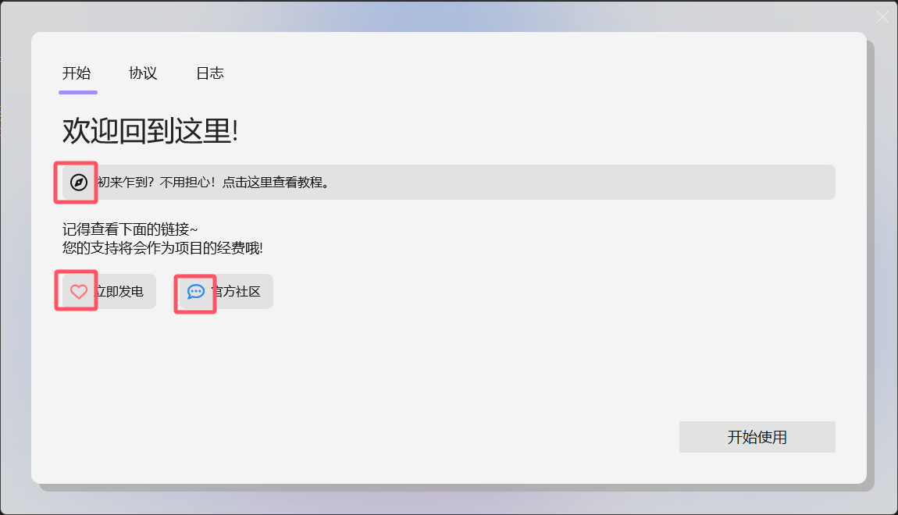

# 使用教程

::: tip TIP
- 视频：[【官方完整教程】想做出自己喜欢的桌面？LightFrame桌面交互布置教程【基础篇】](https://www.bilibili.com/video/BV1yw411q7ct)
:::

## 0x01 初次使用

从[官网](https://lightframe.vertillusion.xyz/)下载 **LightFrame.zip** ，并解压到一个固定的文件夹。  
**请勿直接在压缩包内打开！**  

### 此步骤常见问题处理
::: details 0xc000007b 报错怎么办 (找不到msvcp140.dll等) 
下载安装：[https://aka.ms/vs/16/release/vc_redist.x64.exe](https://aka.ms/vs/16/release/vc_redist.x64.exe)
:::

::: details 欢迎页出现乱码
若出现如图所示位置的乱码（具体表现为显示出来一个小框框而不是图标）重启软件即可

:::

## 0x02 组件的基本属性
右键组件可打开基本属性：

### 编辑
**兼容组件：便签纸全系、Minecraft组件中各类点击域、箱子、按钮、告示牌、工作台**  
可编辑带有文本属性的组件文本，如图

### 事件
关于组件的鼠标响应
_ToDo_

### 混合
设置组件的不透明度，用以贴合壁纸，兼容组件同上

### 更多-调整
可调整组件的大小，兼容组件同上

### 更多-主题色
调整组件的颜色

### 更多-路径切割
可根据需要将组件切割成不规则图形
