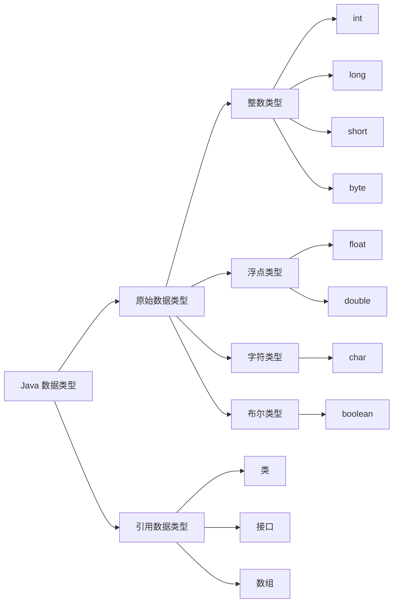

# Markdown 示例

## 目录
- [代码高亮](#代码高亮)
- [容器](#容器)
- [Mermaid 语法](#mermaid) `2025.08.07`
- [Todo 语法](#todo) `2025.08.07`

## 代码高亮
**输入**

````md
```js{4}
export default {
  data () {
    return {
      msg: 'Highlighted!'
    }
  }
}
```
````

**输出**

```js{4}
export default {
  data () {
    return {
      msg: 'Highlighted!'
    }
  }
}
```

## 容器

VitePress 还提供了一些容器，用于在文档中添加额外的信息。

**输入**

```md
::: info
This is an info box.
:::

::: tip
This is a tip.
:::

::: warning
This is a warning.
:::

::: danger
This is a dangerous warning.
:::

::: details
This is a details block.
:::
```

**输出**

::: info
This is an info box.
:::

::: tip
This is a tip.
:::

::: warning
This is a warning.
:::

::: danger
This is a dangerous warning.
:::

::: details
This is a details block.
:::

## Mermaid
### 示例 1
Code with ```mermaid
```md
flowchart LR
  Start --> Stop
```

**输出**

### 示例 2
Code with ```mermaid
```md
graph LR
    A[Java 数据类型] --> B[原始数据类型]
    A[Java 数据类型] --> C[引用数据类型]
    
    B --> D[整数类型]
    B --> E[浮点类型]
    B --> F[字符类型]
    B --> G[布尔类型]
    
    D --> H[int]
    D --> I[long]
    D --> J[short]
    D --> K[byte]
    
    E --> L[float]
    E --> M[double]
    
    F --> N[char]
    
    G --> O[boolean]
    
    C --> P[类]
    C --> Q[接口]
    C --> R[数组]
```


## Todo
**输入**
```md
- [ ] 吃饭
- [ ] 睡觉
- [x] 打豆豆
```
**输出**
- [ ] 吃饭
- [ ] 睡觉
- [x] 打豆豆