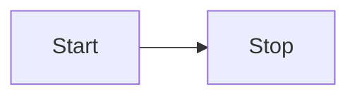
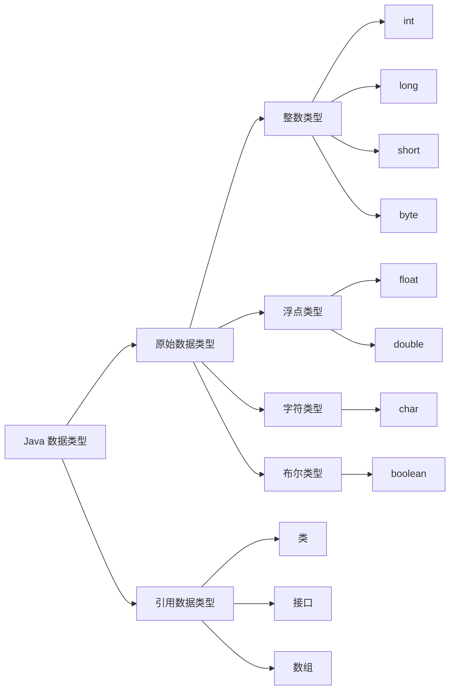

# Markdown 示例
此页将展示 Vitepress 部分已配置的内置语法和添加的额外语法功能，帮助团队快速编写文档。 
**页面没有提供英文版本**

## 目录
- [代码高亮](#代码高亮) <Badge type="info" text="内置" />
- [容器](#容器) <Badge type="info" text="内置" />
- [徽标](#徽标) <Badge type="info" text="内置" />
- [Mermaid 语法](#mermaid) `2025.08.07` <Badge type="tip" text="1.0.0" />
- [Todo 语法](#todo) `2025.08.07` <Badge type="tip" text="1.0.0" />
- [链接块](#linkcard) `2025.08.10` <Badge type="tip" text="1.0.2" />
- [隐藏文字](#closeword) `2025.08.10` <Badge type="tip" text="1.0.0" />
- [下载按钮](#downloadcard) `2025.08.16` <Badge type="tip" text="1.0.0" />
- [批量修改应用版本](#批量修改应用版本) `2025.08.31` <Badge type="warning" text="Beta" />
- [调研项目](#调研项目) `2025.08.31` <Badge type="warning" text="Beta" />


## 代码高亮
**输入**

````md
```js{4}
export default {
  data () {
    return {
      msg: 'Highlighted!'
    }
  }
}
```
````

**输出**

```js{4}
export default {
  data () {
    return {
      msg: 'Highlighted!'
    }
  }
}
```

## 容器

VitePress 还提供了一些容器，用于在文档中添加额外的信息。

**输入**

```md
::: info
This is an info box.
:::

::: tip
This is a tip.
:::

::: warning
This is a warning.
:::

::: danger
This is a dangerous warning.
:::

::: details
This is a details block.
:::
```

**输出**

::: info
This is an info box.
:::

::: tip
This is a tip.
:::

::: warning
This is a warning.
:::

::: danger
This is a dangerous warning.
:::

::: details
This is a details block.
:::

## 徽标
徽标可让你为标题添加状态。例如，指定部分的类型或支持的版本可能很有用。

### 用法

可以使用全局组件 `Badge` 。

**输入**

```html
  Title <Badge type="info" text="default" />
  Title <Badge type="tip" text="^1.9.0" />
  Title <Badge type="warning" text="beta" />
  Title <Badge type="danger" text="caution" />
```

**输出**

Title <Badge type="info" text="default" />

Title <Badge type="tip" text="^1.9.0" />

Title <Badge type="warning" text="beta" />

Title <Badge type="danger" text="caution" />

### 自定义子节点

`<Badge>` 接受 `children`，这将显示在徽标中。

**输入**

```html
Title <Badge type="info">custom element</Badge>
```

**输出**

Title <Badge type="info">custom element</Badge>

## Mermaid
### 示例 1
Code with ```mermaid
```md
flowchart LR
  Start --> Stop
```

**输出**

### 示例 2
Code with ```mermaid
```md
graph LR
    A[Java 数据类型] --> B[原始数据类型]
    A[Java 数据类型] --> C[引用数据类型]
    
    B --> D[整数类型]
    B --> E[浮点类型]
    B --> F[字符类型]
    B --> G[布尔类型]
    
    D --> H[int]
    D --> I[long]
    D --> J[short]
    D --> K[byte]
    
    E --> L[float]
    E --> M[double]
    
    F --> N[char]
    
    G --> O[boolean]
    
    C --> P[类]
    C --> Q[接口]
    C --> R[数组]
```


## Todo
**输入**
```md
- [ ] 吃饭
- [ ] 睡觉
- [x] 打豆豆
```
**输出**
- [ ] 吃饭
- [ ] 睡觉
- [x] 打豆豆

## LinkCard
```md
格式
<Linkcard url="链接" title="标题" description="描述" logo="图标"/>
```

**输入**
```md
<Linkcard url="https://www.vilinko.com" title="Vilinko Studio" description="https://www.vilinko.com" logo="https://www.vilinko.com/img/Newico.png"/>
```

**输出**
<Linkcard url="https://www.vilinko.com" title="Vilinko Studio" description="https://www.vilinko.com" logo="https://www.vilinko.com/img/Newico.png"/>

## CloseWord
这是一个自定义的功能，语法参照下方示例，使用时文字会消失，但仍能被检索。

**输入**
```md
这是一个自定义的功能，语法参照下方示例，使用时<cw>文字</cw>会消失，但仍能被检索。
```
**输出**  
输出内容不可查看，您现在应该看不到“文字”字样。  
这是一个自定义的功能，语法参照下方示例，使用时<cw>文字</cw>会消失，但仍能被检索。

## DownloadCard
**格式**
```md
<DownloadCard url="链接" title="标题" description="描述"/>
```

**输入**
```md
<DownloadCard url="https://www.vilinko.com" title="Vilinko Studio" description="https://www.vilinko.com"/>
```

**输出**
<DownloadCard url="https://www.vilinko.com" title="Vilinko Studio" description="https://www.vilinko.com"/>

## 批量修改应用版本 <Badge type="warning" text="beta" />
::: warning 组件正在测试中
`Version.vue` 是一个正在开发的功能组件，暂时不支持英文语法。  
另外，当前版本在某些情况下（小概率）可能无法正常映射版本文本，需要用户手动刷新。
:::
本插件将应用版本存储在 `support/version.json` 文件中，现在，你可以在相关文档编写中通过 `<num>` 标签来引用对应软件的版本。

若要更新本文档中所有关于此应用的版本，可以直接修改 json 文件。

**格式**
```md
<num>序号</num>
```

**输入**
```md
<num>1</num>
```

**输出**
<num>1</num>

## 调研项目
::: warning 组件正在测试中
`research.vue` 是一个正在开发的功能组件，暂时不支持英文语法。  
另外，当前版本在某些情况下（小概率）可能无法正常映射版本文本，需要用户手动刷新。
:::

本插件将调研链接存储在 `support/research.json` 中，可以通过修改 `status` 字段来控制是否显示调研链接。

**格式**
```md
<research>序号</research>
```

**输入**
```md
<research>1</research>
```
对应的配置为：
```json
[
  {
    "n": "1",
    "name": "示例调查问卷标题",
    "status": "open",
    "links": "/research/"
  }
]
```
未经处理的输出内容，实际不会显示：
```md
数据调研中心正在进行 name ，如果您有时间，欢迎帮助我们优化相关产品。 links
```

**最后输出**
<research>1</research>

<hr>
<h6 style="text-align: center;">更多插件正在开发啦</h6>