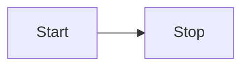
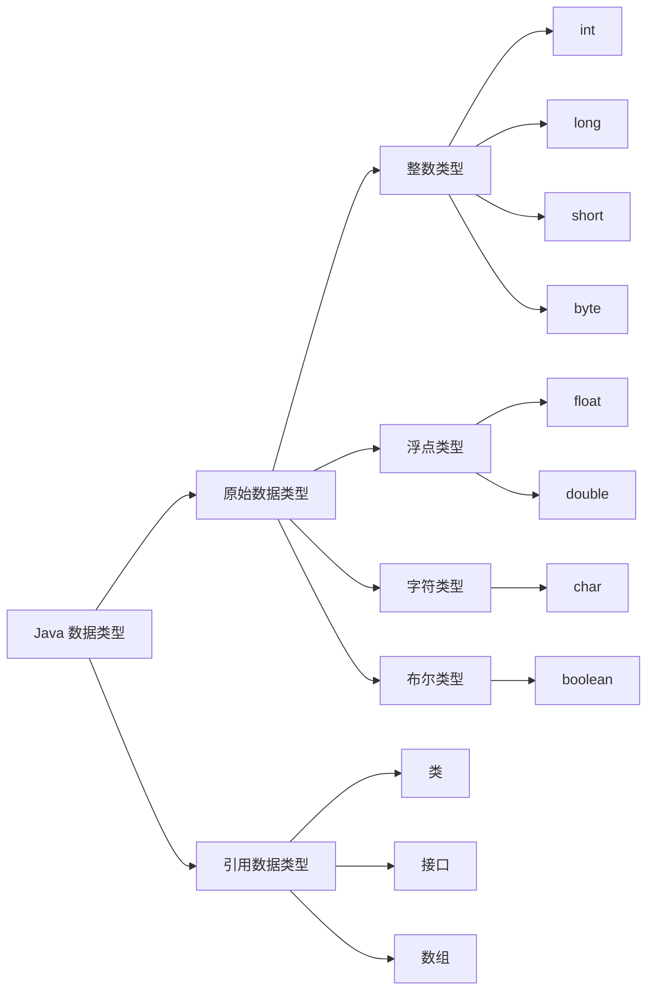

<login>

# Markdown 示例
此页将展示 Vitepress 部分已配置的内置语法和添加的额外语法功能，帮助团队快速编写文档。 
**页面没有提供英文版本，此页面无法使用搜索组件查询，若要分享请使用群内链接跳转。**

## 目录
- [代码高亮](#代码高亮) <Badge type="info" text="内置" />
- [容器](#容器) <Badge type="info" text="内置" />
- [徽标](#徽标) <Badge type="info" text="内置" />
- [Mermaid 语法](#mermaid) `2025.08.07` <Badge type="tip" text="1.0.0" />
- [Todo 语法](#todo) `2025.08.07` <Badge type="tip" text="1.0.0" />
- [链接块](#linkcard) `2025.08.10` <Badge type="tip" text="1.0.2" />
- [下载按钮](#downloadcard) `2025.08.16` <Badge type="tip" text="1.0.0" />
- [多功能按钮](#n-button) `2025.09.20` <Badge type="warning" text="Beta" />


## 代码高亮
**输入**

````md
```js{4}
export default {
  data () {
    return {
      msg: 'Highlighted!'
    }
  }
}
```
````

**输出**

```js{4}
export default {
  data () {
    return {
      msg: 'Highlighted!'
    }
  }
}
```

## 容器

VitePress 还提供了一些容器，用于在文档中添加额外的信息。

**输入**

```md
::: info
This is an info box.
:::

::: tip
This is a tip.
:::

::: warning
This is a warning.
:::

::: danger
This is a dangerous warning.
:::

::: details
This is a details block.
:::
```

**输出**

::: info
This is an info box.
:::

::: tip
This is a tip.
:::

::: warning
This is a warning.
:::

::: danger
This is a dangerous warning.
:::

::: details
This is a details block.
:::

## 徽标
徽标可让你为标题添加状态。例如，指定部分的类型或支持的版本可能很有用。

### 用法

可以使用全局组件 `Badge` 。

**输入**

```html
  Title <Badge type="info" text="default" />
  Title <Badge type="tip" text="^1.9.0" />
  Title <Badge type="warning" text="beta" />
  Title <Badge type="danger" text="caution" />
```

**输出**

Title <Badge type="info" text="default" />

Title <Badge type="tip" text="^1.9.0" />

Title <Badge type="warning" text="beta" />

Title <Badge type="danger" text="caution" />

### 自定义子节点

`<Badge>` 接受 `children`，这将显示在徽标中。

**输入**

```html
Title <Badge type="info">custom element</Badge>
```

**输出**

Title <Badge type="info">custom element</Badge>

## Mermaid
### 示例 1
Code with ```mermaid
```md
flowchart LR
  Start --> Stop
```

**输出**

### 示例 2
Code with ```mermaid
```md
graph LR
    A[Java 数据类型] --> B[原始数据类型]
    A[Java 数据类型] --> C[引用数据类型]
    
    B --> D[整数类型]
    B --> E[浮点类型]
    B --> F[字符类型]
    B --> G[布尔类型]
    
    D --> H[int]
    D --> I[long]
    D --> J[short]
    D --> K[byte]
    
    E --> L[float]
    E --> M[double]
    
    F --> N[char]
    
    G --> O[boolean]
    
    C --> P[类]
    C --> Q[接口]
    C --> R[数组]
```


## Todo
**输入**
```md
- [ ] 吃饭
- [ ] 睡觉
- [x] 打豆豆
```
**输出**
- [ ] 吃饭
- [ ] 睡觉
- [x] 打豆豆

## LinkCard
```md
格式
<Linkcard url="链接" title="标题" description="描述" logo="图标"/>
```

**输入**
```md
<Linkcard url="https://www.vilinko.com" title="Vilinko Studio" description="https://www.vilinko.com" logo="https://www.vilinko.com/img/Newico.png"/>
```

**输出**
<Linkcard url="https://www.vilinko.com" title="Vilinko Studio" description="https://www.vilinko.com" logo="https://www.vilinko.com/img/Newico.png"/>

## DownloadCard
::: warning 组件暂停服务
请使用 `n-button` 代替此组件。
:::

**格式**
```md
<DownloadCard url="链接" title="标题" description="描述"/>
```

**输入**
```md
<DownloadCard url="https://www.vilinko.com" title="Vilinko Studio" description="https://www.vilinko.com"/>
```

**输出**
<DownloadCard url="https://www.vilinko.com" title="Vilinko Studio" description="https://www.vilinko.com"/>

## n-button
这是一个多功能的按钮组件，目前完成了部分功能本地化适配。

### 格式示例
```md
<n-button type="primary">正常状态的 Primary 按钮</n-button>
<br>
<br>
<n-button type="primary" disabled>禁用状态的 Primary 按钮</n-button>
<br>
<br>
<n-button type="primary" loading>加载中状态的 Primary 按钮</n-button>
```
**输出**
<n-button type="primary">正常状态的 primary 按钮</n-button>
<br>
<br>
<n-button type="primary" disabled>禁用状态的 Primary 按钮</n-button>
<br>
<br>
<n-button type="primary" loading>加载中状态的 Primary 按钮</n-button>

### 下载功能
基于 `nuna-design-vue` 组件库创建的功能性按钮组件。

**格式**
```md
  <a href="https://lightframe.vilinko.com/Update/VilinkoUniverse.exe" target="_blank" rel="noopener noreferrer" style="text-decoration: none;">
    <n-button type="primary">下载 / 更新 Vilinko Universe</n-button>
  </a>
```

::: warning
注意：代码不能顶格书写，不空格会导致报错！

~~我也不知道为什么啊，但是顶格写就是会报错qwq~~
:::


**输出**
  <br>
  <a href="https://lightframe.vilinko.com/Update/VilinkoUniverse.exe" target="_blank" rel="noopener noreferrer" style="text-decoration: none;">
    <n-button type="primary">下载 / 更新 Vilinko Universe</n-button>
  </a>